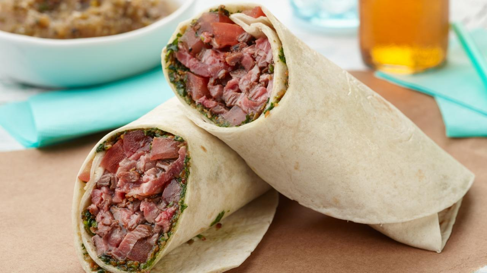

[](https://classroom.github.com/a/_rEaNyCz)
# header 1 
this is the nav bar

# header 2 
this is the content
```html
<h1>Our Menu</h1>
        <div class="flex-container container">
            <div class="menu-container">
                
                <h3>Burito Carne Asada</h3>
                <h5>Burito filled with Mexican authentuic grilled meat</h5>
            </div>
            <div class="menu-container">
                
                <h3>Burito Pollo con Chille</h3>
                <h5>Burito filled with spicy chicken</h5>
            </div>
            <div class="menu-container">
                
                <h3>Burger</h3>
                <h5>Special burger by our restaurant that will crave your gut</h5>
            </div>
        </div>
```
Pictures inside the content :


