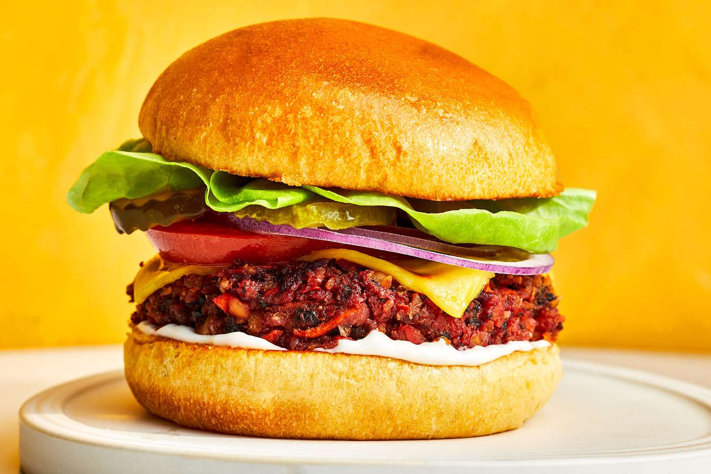

[](https://classroom.github.com/a/_rEaNyCz)
# NAVBAR
sticky
```html
    <header>
        
        <ul>
            <li><a href="#">Home</a></li>
            <li><a href="#">About</a></li>
            <li><a href="#">Menu</a></li>
            <li><a href="#">Contact</a></li>
        </ul>
    </header>
```

# MENU CONTENT
this is the content
```html
<h1>Our Menu</h1>
        <div class="flex-container container">
            <div class="menu-container">
                
                <h3>Burito Carne Asada</h3>
                <h5>Burito filled with Mexican authentuic grilled meat</h5>
            </div>
            <div class="menu-container">
                
                <h3>Burito Pollo con Chille</h3>
                <h5>Burito filled with spicy chicken</h5>
            </div>
            <div class="menu-container">
                
                <h3>Burger</h3>
                <h5>Special burger by our restaurant that will crave your gut</h5>
            </div>
        </div>
```

# ABOUT US
```html
    <div class="aboutUs container">
            <h1>About Us</h1>
            <h3>Lorem ipsum dolor sit amet consectetur adipisicing elit. Exercitationem, atque! Porro magnam odio
                similique officia, architecto nulla minima reprehenderit incidunt adipisci, labore cupiditate!
                Voluptate, ratione?
            </h3>
        </div>
```

# HOW TO REACH US
```html
    <div class="container">
            <h3>Contact Us</h3>
            <form action="">
                <div class="contactUs">
                    <input type="text" id="fname" name="fname" placeholder="Your Name">
                    <input type="text" id="email" name="email" placeholder="Your email">
                </div>
                <textarea name="" id="" cols="30" rows="10">Your Message</textarea>

            </form>
        </div>
```
Pictures inside the content :


<p> https://revou-fsse-5.github.io/module-1-parsadi/ </p>